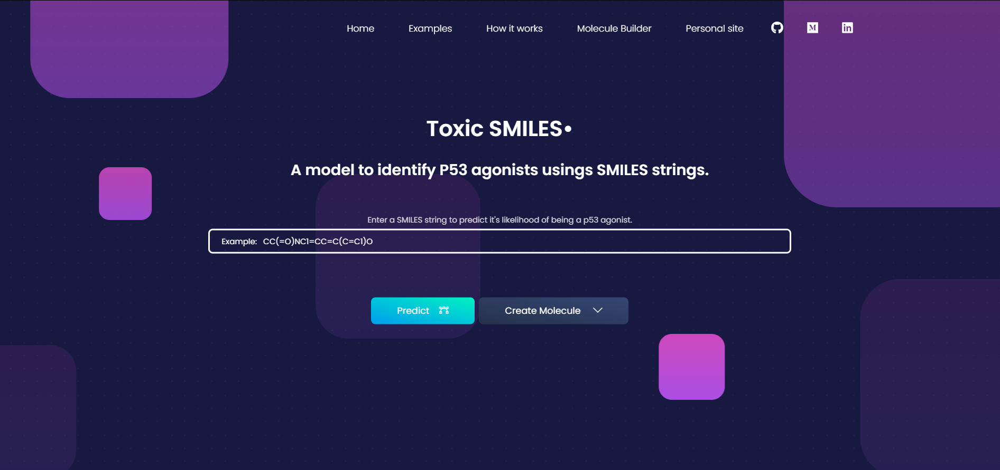

# Toxic SMILES small molecule classifer

# Overview of project

This project was built using RDKIT, Flask, Microsoft Azure, Docker, and Scikit-learn. The model was trained using the TOX21 dataset with about ~8000 molecules. An in-depth write up can be found [here](https://www.gurkamal.com/p53-gc.html) with details including correcting class-imbalance, different classifeirs used, performance metrics, and the theory behind the project.

The web app is now hosted on Render as the cost of Microsoft Azure is much higher. 

### [The app can be found here!](https://toxic-smiles.onrender.com/)

# About

## What is Tox 21?
The Toxicology in the 21st Century program, or Tox21, is a unique collaboration between several federal agencies to develop new ways to rapidly test whether substances adversely affect human health. Substances assayed in Tox21 include a diverse range of products such as: commercial chemicals, pesticides, food additives/contaminants, and medical compounds.

## Why the p53 protein?
The p53 gene encodes a protein of the same name and is known as a tumor-suppressor protein. The p53 protein is expressed in cells when they undergo DNA damage — which can transform a normal cell into a cancerous one. To counteract the effects, p53 can cause growth arrest, repair DNA, or begin the process of cell death. Therefore, when DNA damage occurs, there is a significant increase in p53 expression. This increase in protein expression is a good indicator of irregular cell health. The Tox21 data was generated by testing cell lines which produce a florescent reporter gene product under the control of p53 cellular machinery. By measuring levels of the reporter gene product against various compounds, researchers were able to determine whether a compound was an agonist (activator) of the p53 pathway or not.

## Predicting agonists using molecular fingerprinting

Fingerprinting is a way to represent molecular structure and properties as binary bit strings (0’s and 1's). This representation was initially developed and applied to searching databases for molecules with a specific substructure — but it can also be applied to machine learning. A hash function is a random number generator and is applied to each feature of a molecule, such as the types of bonds and molecules present, which means that they act as seeds to the function.
